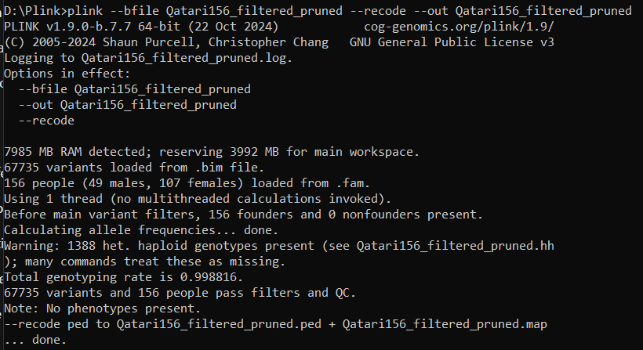

#Reading the data
##Converting .bed .bim .fam files to .map .ped files


##Converting .map .ped files to .gds files 
```{r}
# install.packages("BiocManager")
BiocManager::install(c("SNPRelate", "GENESIS", "GWASTools"), force = TRUE)
```
```{r}
library(SNPRelate)

# Define the file names
ped.fn <- "Qatari156_filtered_pruned.ped"
map.fn <- "Qatari156_filtered_pruned.map"
gds.fn <- "Qatari156_filtered_pruned.gds"

# Convert to GDS format
snpgdsPED2GDS(ped.fn, map.fn, out.gdsfn = gds.fn)
# Open the GDS file
genofile <- snpgdsOpen(gds.fn)
snpgdsClose(genofile)
# Check the GDS file
snpgdsSummary(genofile)
```

##Reading the metabolites data from .csv file
```{r}
metabolites <- read.csv("qatari_metabolites_2025.csv", header = TRUE)

# Check the first few rows of the data
head(metabolites)
```

#Task 1: Compute Kinship using SNPRelate and GENESIS
###Compute IBD Coefficients (Kinship Estimation)
```{r}
# Perform LD pruning to remove correlated SNPs and decreasing cumputational time
#   before the sum of all selected genotypes ~= 16 million
#   after the sum of all selected genotypes ~= 8 million
#   Thus, half the cumputational time
set.seed(1000)
snpset <- snpgdsLDpruning(genofile, ld.threshold = 0.2)
snpset.id <- unlist(snpset)

ibd <- snpgdsIBDMLE(genofile, snp.id = snpset.id, kinship = TRUE)

# Extract IBD matrix
ibd.coeff <- snpgdsIBDSelection(ibd)

print(ibd.coeff)
```

##Convert SNPRelate Object to GENESIS Format
```{r}
library(GWASTools)
library(GENESIS)

# Create GDS reader object
gds <- GdsGenotypeReader(gds.fn)

# Create GenotypeData object for GENESIS
genoData <- GenotypeData(gds)
print(genoData)
```

##Use GENESIS to Calculate Kinship Matrix
```{r}
# Manual Conversion of Pairwise Kinship to a Matrix
# Create vector of unique sample IDs
sample_ids <- unique(c(ibd.coeff$ID1, ibd.coeff$ID2))

# Initialize matrix with zeros
kinMat <- matrix(0,
        nrow = length(sample_ids), ncol = length(sample_ids),
        dimnames = list(sample_ids, sample_ids)
)

# Fill in kinship values
for (i in seq_len(nrow(ibd.coeff))) {
        id1 <- ibd.coeff$ID1[i]
        id2 <- ibd.coeff$ID2[i]
        kin <- ibd.coeff$kinship[i]

        kinMat[id1, id2] <- kin
        kinMat[id2, id1] <- kin
}
```
```{r}
# Run PC-AiR (needed to properly calculate kinship for related individuals)
pca <- pcair(genoData, kinobj = kinMat)

# Run PC-Relate (takes PCs and calculates kinship)
pcrel <- pcrelate(genoData, pcs = pca$vectors[, 1:10]) # Choose # of PCs as needed

# Extract kinship matrix
kinMat <- pcrelateToMatrix(pcrel)

head(kinMat)
```
##Report the number of individuals who have a kinship > 0.1
```{r}
# Set diagonal to 0 to ignore self-kinship
diag(kinMat) <- 0

# Find individuals with at least one kinship > 0.1
kin_above_thresh <- apply(kinMat, 1, function(x) any(x > 0.1))

# Report how many individuals meet this criterion
paste("Number of individuals with kinship > 0.1:", sum(kin_above_thresh))
```
#Task 2: Compute mQTLs with Mixed Models
```{r}
```

#Task 3: Inflation factor calculation
```{r}
```

#Task 4: Manhattan Plot
```{r}
```

#Task 5: Metabolic Networks
```{r}
```
#Task 6: Annotate Significant SNPs
```{r}
```
#Task 7: Regional plots using SNIPA
```{r}
```