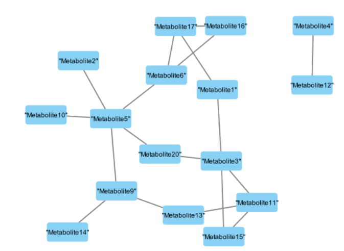

```{r}
# Run before commiting
save.image(file = "my_workspace.RData")
```
```{r}
# Run after opening the project
load("my_workspace.RData")
print("Your variables:")
ls()
```
#Reading the data
##Converting .bed .bim .fam files to .map .ped files


##Converting .map .ped files to .gds files 
```{r}
# install.packages("BiocManager")
# BiocManager::install(c("SNPRelate", "GENESIS", "GWASTools"), force = TRUE)
# install.packages("coxme")
# install.packages("GeneNet")
```
```{r}
library(SNPRelate)

# Define the file names
ped.fn <- "Qatari156_filtered_pruned.ped"
map.fn <- "Qatari156_filtered_pruned.map"
gds.fn <- "Qatari156_filtered_pruned.gds"

# Convert to GDS format
snpgdsPED2GDS(ped.fn, map.fn, out.gdsfn = gds.fn)
# Open the GDS file
genofile <- snpgdsOpen(gds.fn)
snpgdsClose(genofile)
# Check the GDS file
snpgdsSummary(genofile)
```

##Reading the metabolites data from .csv file
```{r}
metabolites <- read.csv("qatari_metabolites_2025.csv", header = TRUE)

# Check the first few rows of the data
head(metabolites)
```


#Task 1: Compute Kinship using SNPRelate and GENESIS
###Compute IBD Coefficients (Kinship Estimation)
```{r}
# Perform LD pruning to remove correlated SNPs and decreasing cumputational time
#   before the sum of all selected genotypes ~= 16 million
#   after the sum of all selected genotypes ~= 8 million
#   Thus, half the cumputational time
set.seed(1000)
snpset <- snpgdsLDpruning(genofile, ld.threshold = 0.2)
snpset.id <- unlist(snpset)

ibd <- snpgdsIBDMLE(genofile, snp.id = snpset.id, kinship = TRUE)

# Extract IBD matrix
ibd.coeff <- snpgdsIBDSelection(ibd)

print(ibd.coeff)
```

##Convert SNPRelate Object to GENESIS Format
```{r}
library(GWASTools)
library(GENESIS)

# Create GDS reader object
gds <- GdsGenotypeReader(gds.fn)

# Create GenotypeData object for GENESIS
genoData <- GenotypeData(gds)

print(genoData) # View as data frame
```

##Use GENESIS to Calculate Kinship Matrix
```{r}
# Manual Conversion of Pairwise Kinship to a Matrix
# Create vector of unique sample IDs
sample_ids <- unique(c(ibd.coeff$ID1, ibd.coeff$ID2))

# Initialize matrix with zeros
kinMat <- matrix(0,
        nrow = length(sample_ids), ncol = length(sample_ids),
        dimnames = list(sample_ids, sample_ids)
)

# Fill in kinship values
for (i in seq_len(nrow(ibd.coeff))) {
        id1 <- ibd.coeff$ID1[i]
        id2 <- ibd.coeff$ID2[i]
        kin <- ibd.coeff$kinship[i]

        kinMat[id1, id2] <- kin
        kinMat[id2, id1] <- kin
}
```
```{r}
# Run PC-AiR (needed to properly calculate kinship for related individuals)
pca <- pcair(genoData, kinobj = kinMat)

# Run PC-Relate (takes PCs and calculates kinship)
pcrel <- pcrelate(genoData, pcs = pca$vectors[, 1:10]) # Choose # of PCs as needed

# Extract kinship matrix
kinMat <- pcrelateToMatrix(pcrel)

head(kinMat)
```
##Report the number of individuals who have a kinship > 0.1
```{r}
# Set diagonal to 0 to ignore self-kinship
diag(kinMat) <- 0

# Find individuals with at least one kinship > 0.1
kin_above_thresh <- apply(kinMat, 1, function(x) any(x > 0.1))

# Report how many individuals meet this criterion
paste("Number of individuals with kinship > 0.1:", sum(kin_above_thresh))
```
#Task 2: Compute mQTLs with Mixed Models
```{r}
```

#Task 3: Inflation factor calculation
```{r}
```

#Task 4: Manhattan Plot
```{r}
```

#Task 5: Metabolic Networks
##Correct metabolites for covariates and kinship using polygenic() residuals
```{r}
library(Matrix)
library(coxme) # Load coxme for lmekin

# Create a kinship matrix suitable for lmekin
kin_mat <- as.matrix(kinMat)
kin_mat <- kin_mat[pca$sample.id, pca$sample.id] # Align rows/cols
# Add a small value to the diagonal to ensure positive definiteness
kin_mat <- kin_mat + diag(1e-6, nrow(kin_mat))
# Force kin_mat to be positive semi-definite using nearPD
kin_mat <- as.matrix(Matrix::nearPD(kin_mat)$mat)

corrected_metabs <- data.frame(sample.id = pca$sample.id)

for (metab in colnames(metabolites)) {
        df <- data.frame(
                value = as.numeric(metabolites[[metab]]),
                PC1 = as.numeric(pca$vectors[, 1]),
                PC2 = as.numeric(pca$vectors[, 2]),
                PC3 = as.numeric(pca$vectors[, 3]),
                id = pca$sample.id
        )
        # Remove rows with NA values
        df <- na.omit(df)
        if (nrow(df) == 0) {
                warning(paste("No valid data for metabolite:", metab))
                next
        }
        # Mixed model using kinship as random effect
        model <- lmekin(value ~ PC1 + PC2 + PC3 + (1 | id),
                data = df,
                varlist = kin_mat
        )
        # Residuals = corrected metabolite
        corrected_metabs[[metab]] <- resid(model)
}
head(corrected_metabs)
```

##Use GeneNet to Compute Partial Correlation Network
```{r}
library(GeneNet)
# Remove columns with all NA or zero variance
good_cols <- colSums(is.na(corrected_mat)) < nrow(corrected_mat) & apply(corrected_mat, 2, function(x) var(x, na.rm = TRUE) > 0)
corrected_mat <- corrected_mat[, good_cols]
# Remove rows with any NA values
corrected_mat <- na.omit(corrected_mat)

# Estimate shrinkage partial correlations
pcor <- ggm.estimate.pcor(corrected_mat)

# Test edges
network <- network.test.edges(pcor)

# Try a higher FDR threshold if no edges at 0.05
sig_edges <- network[network$qval < 0.05, ]
if (nrow(sig_edges) == 0) {
        sig_edges <- network[network$qval < 0.1, ]
        message(paste("No edges at FDR < 0.05. Using FDR < 0.1:", nrow(sig_edges), "edges found."))
} else {
        message(paste("Edges found at FDR < 0.05:", nrow(sig_edges)))
}

# Try even higher FDR thresholds if no edges at 0.1
if (nrow(sig_edges) == 0) {
        sig_edges <- network[network$qval < 0.2, ]
        if (nrow(sig_edges) == 0) {
                sig_edges <- network[network$qval < 0.25, ]
                if (nrow(sig_edges) == 0) {
                        message("No significant edges found at FDR < 0.25.")
                } else {
                        message(paste("Edges found at FDR < 0.25:", nrow(sig_edges)))
                }
        } else {
                message(paste("Edges found at FDR < 0.2:", nrow(sig_edges)))
        }
}

# Prepare edge list for Cytoscape
if (nrow(sig_edges) > 0) {
        cyto_edges <- sig_edges[, c("node1", "node2", "pcor", "qval")]
        colnames(cyto_edges)[1:2] <- c("source", "target")
        write.csv(cyto_edges, "Significant_Metabolite_Network_Cytoscape.csv", row.names = FALSE)
} else {
        message("No significant edges found at FDR < 0.25.")
}
```
##Visualize in Cytoscape

##Analyze Network in Cytoscape
```{r}
cytoscapeNetworkAnalysis <- read.csv("cytoscapeNetworkAnalysis.csv", header = TRUE)
print(cytoscapeNetworkAnalysis)
```

#Task 6: Annotate Significant SNPs
```{r}
```
#Task 7: Regional plots using SNIPA
```{r}
```