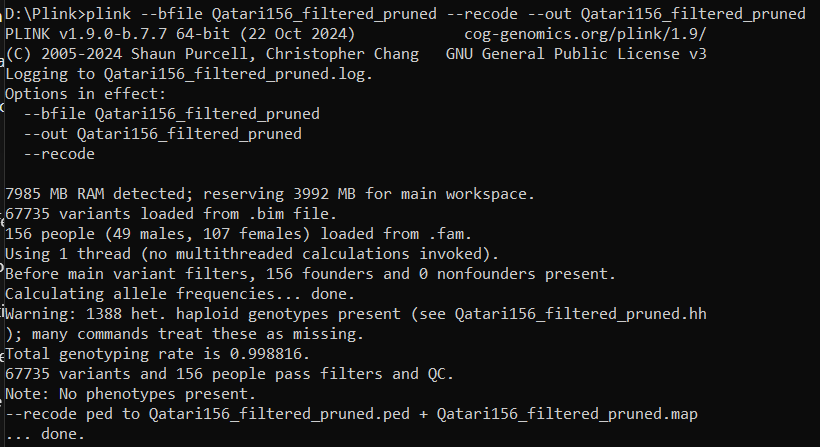

```{r load_workspace, include=FALSE}
# Run after opening the project
load("my_workspace.RData")
print("Your variables:")
ls()
```

```{r}
# Run before commiting
save.image(file = "my_workspace.RData")
```

#Reading the data
##Converting .bed .bim .fam files to .map .ped files


##Converting .map .ped files to .gds files 
```{r}
# install.packages("BiocManager")
# BiocManager::install(c("SNPRelate", "GENESIS", "GWASTools"), force = TRUE)
# install.packages("coxme")
# install.packages("GeneNet")
# install.packages("openxlsx")
# install.packages("qqman")
# BiocManager::install("SummarizedExperiment")
# install.packages('tinytex')
# tinytex::install_tinytex()
```
```{r}
library(SNPRelate)

# Define the file names
ped.fn <- "Qatari156_filtered_pruned.ped"
map.fn <- "Qatari156_filtered_pruned.map"
gds.fn <- "Qatari156_filtered_pruned.gds"

# Convert to GDS format
snpgdsPED2GDS(ped.fn, map.fn, out.gdsfn = gds.fn)
# Open the GDS file
genofile <- snpgdsOpen(gds.fn)

# Check the GDS file
snpgdsSummary(genofile)
# Closing the GDS file
snpgdsClose(genofile)
```

##Reading the metabolites data from .csv file
```{r}
metabolites <- read.csv("qatari_metabolites_2025.csv", header = TRUE)

# Check the first few rows of the data
head(metabolites)
```


#Task 1: Compute Kinship using SNPRelate and GENESIS
###Compute IBD Coefficients (Kinship Estimation)
```{r}
# Complete Kinship Analysis Workflow (Verified 2024)
library(SNPRelate)
library(GENESIS)
library(GWASTools)
library(BiocParallel)

# Compute KING kinship with SNPRelate
gds <- snpgdsOpen(gds.fn)
king_kinship <- snpgdsIBDKING(gds, num.thread = 2)
closefn.gds(gds)

# Prepare GENESIS objects
geno <- GdsGenotypeReader(gds.fn)
genoData <- GenotypeData(geno)

# Add sample IDs to kinship matrix
sample_ids <- getScanID(genoData)
kinship_matrix <- king_kinship$kinship
dimnames(kinship_matrix) <- list(sample_ids, sample_ids)

# Run PC-AiR
pca <- pcair(genoData,
        kinobj = kinship_matrix,
        divobj = kinship_matrix,
        kin.thresh = 0.0442,
        div.thresh = -0.0442
)

# Prepare for PC-Relate with current syntax
iterator <- GenotypeBlockIterator(genoData)

# Current working version of pcrelate (as of GENESIS 2.22.0)
pcrelate_results <- pcrelate(iterator,
        pcs = pca$vectors[, 1:2], # Note 'pcs' parameter
        training.set = pca$unrels,
        verbose = TRUE
)

# Get kinship matrix
kinship_matrix <- pcrelateToMatrix(pcrelate_results)

# Clean up
close(genoData)
```
##Report the number of individuals who have a kinship > 0.1
```{r}
# Convert kinship matrix to a regular matrix if it's a Matrix object
if (inherits(kinship_matrix, "Matrix")) {
        kinship_matrix <- as.matrix(kinship_matrix)
}

# Get all pairwise combinations
sample_ids <- rownames(kinship_matrix)
kinship_pairs <- data.frame(
        ID1 = rep(sample_ids, each = length(sample_ids)),
        ID2 = rep(sample_ids, times = length(sample_ids)),
        kinship = as.vector(kinship_matrix),
        stringsAsFactors = FALSE
)

# Remove self-comparisons and keep only unique pairs (upper triangle)
kinship_pairs <- kinship_pairs[kinship_pairs$ID1 != kinship_pairs$ID2, ]
kinship_pairs <- kinship_pairs[!duplicated(t(apply(kinship_pairs[, 1:2], 1, sort))), ]

# Filter for kinship > 0.1
high_kinship <- kinship_pairs[kinship_pairs$kinship > 0.1, ]

# Count results
num_pairs <- nrow(high_kinship)
num_individuals <- length(unique(c(high_kinship$ID1, high_kinship$ID2)))

# Report results
cat("Number of individual pairs with kinship > 0.1:", num_pairs, "\n")
cat("Number of unique individuals involved:", num_individuals, "\n")
```
#Task 2: Compute mQTLs with Mixed Models

## load needed packages
```{r}
library(SNPRelate)
library(SeqVarTools)
library(GENESIS)
library(SummarizedExperiment)
library(writexl)
```


```{r}
metab_t <- metabolites
rownames(metab_t) <- metabolites$Sample
setdiff(covar$sample.id, rownames(metab_t))

# metab_t <- as.data.frame(t(metab_t[ , -1]))

metab_t <- (metab_t[, -1])
```
```{r}
# Make sample-level table
sampleTable <- merge(covar, data.frame(sample.id = rownames(metab_t)), by = "sample.id")

# Check overlap
common_ids <- intersect(sampleTable$sample.id, rownames(metab_t))
length(common_ids) # Should match nrow(sampleTable)

# Subset both to common IDs
sampleTable_sub <- sampleTable[sampleTable$sample.id %in% common_ids, ]
metab_sub <- metab_t[common_ids, ]

# Reorder both to the same sample ID order
sampleTable_sub <- sampleTable_sub[order(sampleTable_sub$sample.id), ]
metab_sub <- metab_sub[order(rownames(metab_sub)), ]

metab_fixed <- t(metab_sub) # Now 20 rows × 156 columns

# Check alignment again
stopifnot(identical(colnames(metab_fixed), sampleTable_sub$sample.id))

# Build the SE object
se <- SummarizedExperiment(
        assays = SimpleList(metab = metab_fixed),
        colData = sampleTable_sub
)
```

```{r}
all(rownames(kinMat) %in% pd$sample.id) # Should be TRUE
all(pd$sample.id %in% rownames(kinMat)) # Should be TRUE

all(rownames(kinMat) == colnames(kinMat)) # Should be TRUE (kinship matrix must be symmetric)
```

```{r}
library(Matrix)

kinMat_PD <- as.matrix(nearPD(kinMat)$mat)
nullMods <- list()

for (m in rownames(assay(se, "metab"))) {
        pheno <- data.frame(
                sample.id = colnames(assay(se, "metab")),
                y = assay(se, "metab")[m, ]
        )

        pd <- merge(sampleTable, pheno, by = "sample.id")
        rownames(pd) <- pd$sample.id
        pd <- pd[rownames(kinMat_PD), ]

        nullMods[[m]] <- GENESIS::fitNullModel(
                x = pd,
                outcome = "y",
                covars = c("PC1", "PC2", "PC3"),
                family = "gaussian",
                cov.mat = kinMat_PD
        )
}
```

```{r}
kinMat_PD <- as.matrix(nearPD(kinMat)$mat)
nullMods <- list()
pheno_data_list <- list() # Store phenotype data frames for creating SeqVarData

for (m in rownames(assay(se, "metab"))) {
        # Create phenotype data frame for the current metabolite
        pheno <- data.frame(
                sample.id = colnames(assay(se, "metab")),
                y = assay(se, "metab")[m, ]
        )

        # Merge with sample metadata and ensure sample order matches kinship matrix
        pd <- merge(sampleTable, pheno, by = "sample.id")
        rownames(pd) <- pd$sample.id
        pd <- pd[rownames(kinMat_PD), ] # Ensure order matches kinMat_PD

        # Store the prepared phenotype data frame for later use with SeqVarData
        pheno_data_list[[m]] <- pd

        # Fit the null model for the current metabolite
        nullMods[[m]] <- GENESIS::fitNullModel(
                x = pd, # Use the prepared data frame
                outcome = "y",
                covars = c("PC1", "PC2", "PC3"),
                family = "gaussian",
                cov.mat = kinMat_PD
        )
}
```


```{r}
library(SeqVarTools)
library(SeqArray)
library(SNPRelate)
library(Biobase)


# Open the SeqArray GDS file
seq_file <- "Qatari156_filtered_pruned_SeqArray.gds"
geno_file <- seqOpen(seq_file)


seqData <- SeqVarData(geno_file)
iterator <- SeqVarBlockIterator(seqData)


allResults <- do.call(rbind, lapply(names(nullMods), function(m) {
        at <- assocTestSingle(
                null.model = nullMods[[m]],
                gdsobj = iterator,
                test = "Score"
        )
        if (nrow(at) > 0) {
                cbind(metabolite = m, at)
        } else {
                NULL # skip if empty
        }
}))


seqClose(iterator)
```

```{r}
colnames(allResults)
```


```{r}
# 1. Filter significant results
significantResults <- allResults[allResults$Score.pval < 0.0001, ]

# 2. Create a clean data frame with only relevant columns
output <- data.frame(
        metabolite     = significantResults$metabolite,
        beta           = significantResults$Est,
        SE             = significantResults$Est.SE,
        effect.allele  = significantResults$allele.index,
        n              = significantResults$n.obs,
        pval           = significantResults$Score.pval
)

# 3. Write to Excel
write_xlsx(output, path = "mQTL_significant_p1e4.xlsx")
```

#Task 3: Inflation factor calculation
```{r}
library(SummarizedExperiment)

# 1. Get unique metabolites from results
unique_metabolites <- unique(output$metabolite)
n_metab <- length(unique_metabolites)

# 2. Initialize results data frame
lambda_results <- data.frame(
        metabolite = unique_metabolites,
        lambda = numeric(n_metab),
        stringsAsFactors = FALSE
)

# 3. Calculate lambda for each metabolite
for (i in 1:n_metab) {
        current_metab <- unique_metabolites[i]

        # Get p-values for current metabolite
        pvals <- output$pval[output$metabolite == current_metab]

        # Remove NA p-values
        pvals <- pvals[!is.na(pvals)]

        # Handle extreme p-values
        pvals[pvals < 1e-20] <- 1e-20
        pvals[pvals > (1 - 1e-10)] <- 1 - 1e-10

        # Calculate chi-square statistics
        chisq <- qchisq(1 - pvals, df = 1)

        # Calculate lambda
        lambda_results$lambda[i] <- median(chisq) / qchisq(0.5, df = 1)
}

# 4. Calculate counts per metabolite for weighting
counts <- sapply(unique_metabolites, function(m) sum(output$metabolite == m))

# 5. Calculate weighted average lambda
average_lambda <- sum(lambda_results$lambda * counts) / sum(counts)

# 6. Report results
cat("=== mQTL Inflation Factors ===\n")
print(lambda_results[order(lambda_results$lambda, decreasing = TRUE), ])
cat("\nAverage inflation factor (weighted):", round(average_lambda, 4), "\n")
```

#Task 4: Manhattan Plot
```{r}
library(qqman)

# 1. Prepare your data
manhattan_data <- data.frame(
        SNP = allResults$variant.id, # SNP IDs
        CHR = as.numeric(allResults$chr), # Chromosome as numeric
        BP = allResults$pos, # Base pair position
        P = allResults$Score.pval # P-values
)

# 2. Create Manhattan plot
manhattan(manhattan_data,
        main = "mQTL Manhattan Plot",
        ylim = c(0, 10), # Adjust based on your p-values
        suggestiveline = -log10(1e-4), # Suggestive threshold
        genomewideline = -log10(5e-8), # Genome-wide significant
        col = c("blue4", "orange3"), # Alternating colors
        cex = 0.6, # Point size
        cex.axis = 0.9
) # Axis text size
```

```{r}
library(dplyr)
library(ggplot2)
# 1. Prepare data with chromosome colors
plot_data <- manhattan_data %>%
        group_by(CHR) %>%
        mutate(color = if_else(CHR %% 2 == 1, "odd", "even"))

# 2. Create plot
ggplot(plot_data, aes(x = BP, y = -log10(P), color = color)) +
        geom_point(alpha = 0.6, size = 1.5) +
        facet_grid(. ~ CHR, scales = "free_x", space = "free_x") +
        geom_hline(yintercept = -log10(5e-8), color = "red", linetype = "dashed") +
        geom_hline(yintercept = -log10(1e-4), color = "blue", linetype = "dashed") +
        scale_color_manual(values = c("odd" = "deepskyblue3", "even" = "goldenrod2")) +
        labs(
                title = "mQTL Manhattan Plot",
                x = "Chromosomal Position",
                y = "-log10(p-value)"
        ) +
        theme_minimal() +
        theme(
                legend.position = "none",
                panel.spacing.x = unit(0.1, "lines"),
                axis.text.x = element_blank()
        )
```

#Task 5: Metabolic Networks
##Correct metabolites for covariates and kinship using polygenic() residuals
```{r}
library(Matrix)
library(coxme) # Load coxme for lmekin

# Create a kinship matrix suitable for lmekin
kin_mat <- as.matrix(kinship_matrix)
kin_mat <- kin_mat[pca$sample.id, pca$sample.id] # Align rows/cols
# Add a small value to the diagonal to ensure positive definiteness
kin_mat <- kin_mat + diag(1e-6, nrow(kin_mat))
# Force kin_mat to be positive semi-definite using nearPD
kin_mat <- as.matrix(Matrix::nearPD(kin_mat)$mat)

corrected_metabs <- data.frame(sample.id = pca$sample.id)

for (metab in colnames(metabolites)) {
        df <- data.frame(
                value = as.numeric(metabolites[[metab]]),
                PC1 = as.numeric(pca$vectors[, 1]),
                PC2 = as.numeric(pca$vectors[, 2]),
                PC3 = as.numeric(pca$vectors[, 3]),
                id = pca$sample.id
        )
        # Remove rows with NA values
        df <- na.omit(df)
        if (nrow(df) == 0) {
                warning(paste("No valid data for metabolite:", metab))
                next
        }
        # Mixed model using kinship as random effect
        model <- lmekin(value ~ PC1 + PC2 + PC3 + (1 | id),
                data = df,
                varlist = kin_mat
        )
        # Residuals = corrected metabolite
        corrected_metabs[[metab]] <- resid(model)
}
```
```{r}
head(corrected_metabs)
```

##Use GeneNet to Compute Partial Correlation Network
```{r}
# Load required package
library(GeneNet)

# 1. Prepare metabolite data (samples=rows, metabolites=columns)
metab_data <- corrected_metabs[, -1] # Exclude sample.id column
rownames(metab_data) <- corrected_metabs$sample.id

# 2. Clean data - remove invariant metabolites and samples with NAs
metab_clean <- metab_data[, apply(metab_data, 2, var, na.rm = TRUE) > 0]
metab_clean <- na.omit(metab_clean)
metabolite_names <- colnames(metab_clean)

# 3. Compute partial correlations between METABOLITES (columns)
# Note: We DON'T transpose here - metabolites should be columns
pcor_matrix <- ggm.estimate.pcor(as.matrix(metab_clean), method = "dynamic")
rownames(pcor_matrix) <- colnames(pcor_matrix) <- metabolite_names

# 4. Test for significant metabolite-metabolite edges
network_test <- network.test.edges(pcor_matrix, fdr = TRUE, direct = TRUE)

# 5. Create edges data frame with metabolite names
edges <- data.frame(
        source = metabolite_names[network_test$node1],
        target = metabolite_names[network_test$node2],
        pcor = network_test$pcor,
        pval = network_test$pval,
        stringsAsFactors = FALSE
)

# 6. Remove any NA values and filter significant edges
edges <- edges[complete.cases(edges), ]
sig_edges <- edges[edges$pval < 0.05, ]

# 7. Create nodes data frame
nodes <- data.frame(
        id = metabolite_names,
        nodeType = "metabolite",
        stringsAsFactors = FALSE
)

# 8. Save results
write.csv(sig_edges, "metabolite_network_edges.csv", row.names = FALSE)
write.csv(nodes, "metabolite_network_nodes.csv", row.names = FALSE)

# 9. Verification output
cat("=== Network Analysis Results ===\n")
cat("Samples analyzed:", nrow(metab_clean), "\n")
cat("Metabolites analyzed:", length(metabolite_names), "\n")
cat("Significant edges (q < 0.05):", nrow(sig_edges), "\n")

if (nrow(sig_edges) > 0) {
        cat("\nSample of significant edges:\n")
        print(head(sig_edges, 5))
} else {
        cat("\nNo significant edges found at q < 0.05\n")
}
```
##Visualize in Cytoscape

##Analyze Network in Cytoscape
```{r}
cytoscapeNetworkAnalysis <- read.csv("cytoscapeNetworkAnalysis.csv", header = TRUE)
print(cytoscapeNetworkAnalysis)
```

#Task 6: Annotate Significant SNPs
```{r}
library(dplyr)

top20_snps <- allResults %>%
        arrange(Score.pval) %>%
        distinct(variant.id, .keep_all = TRUE) %>%
        slice(1:20)

annovar_input <- data.frame(
        chr = top20_snps$chr,
        start = top20_snps$pos,
        end = top20_snps$pos,
        ref = substr(top20_snps$allele.index, 1, 1), # First allele as ref
        alt = substr(top20_snps$allele.index, 3, 3), # Second allele as alt
        snp_id = top20_snps$variant.id,
        stringsAsFactors = FALSE
)

# 3. Write ANNOVAR input (tab-delimited, no header)
write.table(annovar_input, "top_snps_annovar_input.txt",
        sep = "\t", quote = FALSE, row.names = FALSE, col.names = FALSE
)
```
#Task 7: Regional plots using SNIPA
```{r}
top5_snps <- allResults %>%
        arrange(Score.pval) %>%
        distinct(variant.id, .keep_all = TRUE) %>%
        slice(1:5)
```